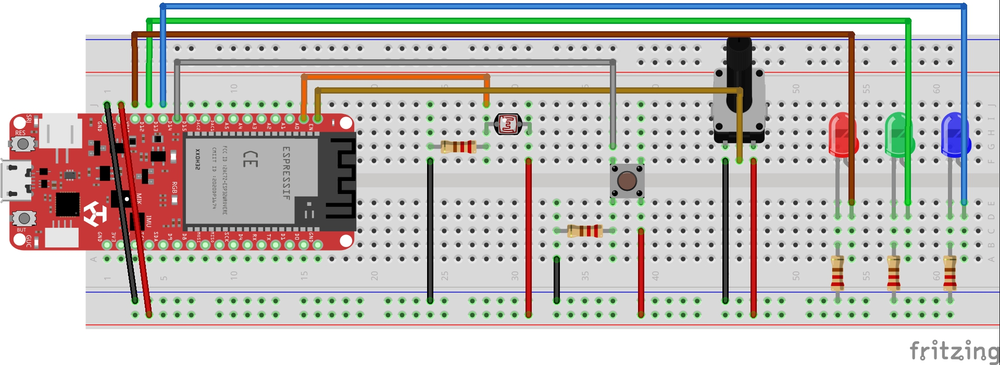

# 📟 Deneyap Kart Python Haberleşme
Python terminalden deneyapkart input-output işlemleri - seri haberleşme örneği.

# 🧐 Kullanım
* Python, Arduino IDE ve Deneyap Kart kütüphanesi'nin bilgisayarınızda kurulu olduğundan emin olun.
```bash
$ git clone https://github.com/orhanemree/deneyapkart-python-haberlesme.git
$ cd deneyapkart-python-haberlesme
```
* Deneyapkart ile şemadaki devreyi kurun ve kodu (``deneyapkart-python-haberlesme.ino``) karta gönderin.
```bash
$ python main.py
```

# 🧮 Şema


# 🎉 Özellikler
* 3 renk lede dijital veri yaz.
* Butondan dijital okuma yap.
* Potansiyometreden analog okuma yap.
* Işık sensöründen analog okuma yap.

# 📚 Kaynaklar
* [Deneyap Kart](https://deneyapkart.org/)

# 📃 Lisans
* [MIT](https://github.com/orhanemree/deneyapkart-python-haberlesme/blob/master/LICENSE) Lisansı ile lisanslanmıştır.